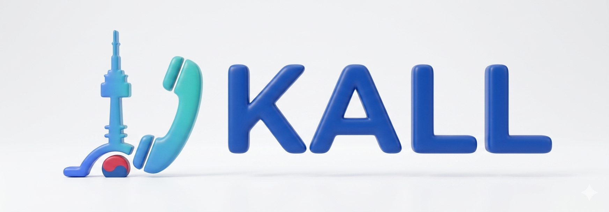

<!doctype html>
<html lang="en">
<head>
  <meta charset="utf-8">
  <meta name="viewport" content="width=device-width, initial-scale=1, viewport-fit=cover">
  <meta name="theme-color" content="#ffffff">
  <meta name="description" content="Kall helps travelers in Korea book tickets, reservations, and local services through Korean-speaking assistance.">
  <title>Kall | Korea Ticket Booking Assistant</title>
  
</head>
<body>
  <main class="app">
    <header class="topbar">
      <a class="brand" href="#" data-nav="intro" aria-label="Kall home">
        

        

          
Kall

          
Korea ticket booking help

        

      </a>
      <button class="icon-btn" type="button" aria-label="Language is English">
        <svg class="lang-icon" viewBox="0 0 24 24" fill="none" aria-hidden="true">
          <path d="M12 21a9 9 0 1 0 0-18 9 9 0 0 0 0 18Z" stroke="currentColor" stroke-width="2"/>
          <path d="M3.7 9h16.6M3.7 15h16.6M12 3c2 2.2 3 5.2 3 9s-1 6.8-3 9c-2-2.2-3-5.2-3-9s1-6.8 3-9Z" stroke="currentColor" stroke-width="2" stroke-linecap="round"/>
        </svg>
        EN
      </button>
    </header>

    <section class="view active" id="view-intro">
      

        

          
Ticket-first concierge

          <h1>Korea tickets, booked through a local voice.</h1>
          
Send us the event, ticket link, date, seats, and payment limits. Kall handles Korean calls, site checks, and booking coordination, then sends the result to your messenger.

          

            <button class="btn" type="button" data-nav="book">
              <svg class="icon" viewBox="0 0 24 24" fill="none"><path d="M5 5h14v14H5z" stroke="currentColor" stroke-width="2.2"/><path d="M8 9h8M8 13h5" stroke="currentColor" stroke-width="2.2" stroke-linecap="round"/></svg>
              Request tickets
            </button>
            <button class="btn secondary" type="button" data-nav="status">Track request</button>
          

        

        

          
KRKorean call ready

          

            

              
<b>Kall</b>Checking seats

              

                <h3>Baseball in Seoul</h3>
                
Jamsil Stadium, 2 seats, Saturday night, backup section included.

                
Ticket requestReceived

                
Venue/account checkLive

                
Result to messengerNext

              

            

          

          
WFrom 1,250 KRW/min

        

      

      <section class="section">
        

Most requested by travelers
<h2>Built around Korean ticket friction.</h2>

        

          <article class="ticket-chip">
BB

<b>Baseball tickets</b>KBO games, seat sections, same-day checks
</article>
          <article class="ticket-chip">
CV

<b>Concerts and festivals</b>Availability, Korean-only notices, purchase help
</article>
          <article class="ticket-chip">
SH

<b>Shows and musicals</b>Dates, cast schedule, seat alternatives
</article>
          <article class="ticket-chip">
TR

<b>Trip bookings</b>Train, theme park, pickup, restaurant backups
</article>
        

      </section>

      <section class="section pricing-section">
        

          

            
Pricing policy

            <h2>Time-based support, inspired by Wonderful.</h2>
          

        

        

          
Choose the time bank that fits your trip

          

            <article class="price-card lite" data-plan-card="lite" role="button" tabindex="0">
              

<h3>Travel Lite</h3>

2,000<small>KRW / min</small>

              
Best for one short ticket check or a single reservation task.

              
<ul class="plan-feature-list"><li>Minimum deposit: 180,000 KRW</li><li>Includes 1.5 hours</li><li>Refund scheduled after 1 month</li><li>No package discount</li></ul>

              
Example: one baseball ticket purchase or one restaurant booking with a clear backup.

            </article>

            <article class="price-card wonderful featured selected" data-plan-card="wonderful" role="button" tabindex="0">
              Recommended
              

<h3>Wonderful</h3>

1,500<small>KRW / min</small>

              
Recommended for most visitors booking tickets, restaurants, and itinerary items.

              
<ul class="plan-feature-list"><li>Minimum deposit: 360,000 KRW</li><li>Includes 4 hours</li><li>5% first-time discount</li><li class="plan-diff">Refund scheduled after 3 months</li></ul>

              
Example: concert ticket check plus restaurant and transportation coordination.

            </article>

            <article class="price-card super" data-plan-card="super" role="button" tabindex="0">
              

<h3>Super</h3>

1,250<small>KRW / min</small>

              
For heavy users or groups with many requests during a Korea trip.

              
<ul class="plan-feature-list"><li>Minimum deposit: 900,000 KRW</li><li>Includes 12 hours</li><li>Lowest per-minute rate</li><li class="plan-diff">Non-refundable; forfeited after 3 months</li></ul>

              
Example: group itinerary with multiple ticket, venue, delivery, and booking tasks.

            </article>
          

          

            <b>Payment note:</b> foreign card and PayPal payments may include an 8.5% processing and currency-exchange fee. On-site payment, Korean bank transfer, or Wise may reduce the fee when available.
            <a href="https://www.gowonderfully.com/pricing" target="_blank" rel="noopener">Reference</a>
          

        

      </section>

      <section class="section">
        

How long does it take?
<h2>Ticket work is usually measured in minutes.</h2>

        

          <article class="estimate-card">
BB

<b>Buy baseball tickets</b>Seat checks, account friction, payment coordination

15-30 min
</article>
          <article class="estimate-card">
CV

<b>Buy concert tickets</b>Availability, purchase flow, troubleshooting

15-45 min
</article>
          <article class="estimate-card">
MV

<b>Buy movie tickets</b>Fastest ticket flow when details are clear

10-20 min
</article>
          <article class="estimate-card">
RS

<b>Dinner reservation</b>Call the venue and confirm details

3-8 min
</article>
        

        
These are rough processing estimates. Sold-out events, vendor holds, payment issues, and changed preferences can add time.

      </section>

      <section class="section">
        

Refunds and work rules
<h2>Clear before the request starts.</h2>

        

          <article class="notice-card refund">
            <h3>Refund policy</h3>
            <ul>
              <li>Used assistant time, completed work, and third-party ticket fees are not refundable through Kall.</li>
              <li>For Travel Lite and Wonderful, unused remaining balance can be requested for refund and is typically processed within 1 week.</li>
              <li>Travel Lite unused balance is scheduled for refund after 1 month unless you top up to extend.</li>
              <li>Wonderful unused balance is scheduled for refund after 3 months unless you top up to extend.</li>
              <li>Super time is non-refundable and is forfeited after 3 months.</li>
              <li>Ticket provider cancellation rules are separate from Kall service time.</li>
            </ul>
          </article>
          <article class="notice-card time">
            <h3>Time charged</h3>
            <ul>
              <li>Charged time includes chat clarification, research, phone calls, messaging, reports, and request troubleshooting.</li>
              <li>Not charged: idle waiting, explaining how the service works, Kall-side mistakes, lunch breaks, or closed hours.</li>
              <li>Business hours are 10 a.m. to 8 p.m. KST, Monday to Saturday.</li>
              <li>Accepted work outside regular hours may be charged at 2x the regular rate; otherwise it starts next business day.</li>
            </ul>
          </article>
        

      </section>

      <section class="section">
        

How it works
<h2>Three steps, no Korean phone needed.</h2>

        

          <article class="step-card">
1

<b>Send ticket details</b>Event name, link, date, seats, budget, and backup options.
</article>
          <article class="step-card">
2

<b>Kall works in Korean</b>We check the local site, call if needed, and clarify purchase rules.
</article>
          <article class="step-card">
3

<b>Get a result</b>Receive booking status, remaining time, and next steps through messenger.
</article>
        

      </section>
    </section>

    <section class="view" id="view-book">
      <section class="section" style="margin-top:16px;">
        

          

            
Ticket request

            <h2>Plan first, then details.</h2>
            
This prototype saves the request in your browser only. Connect payment and backend later.

          

        

        

          

            
<b>1</b>Plan

            
<b>2</b>Details

            
<b>3</b>Review

          

          <form class="form-card" id="bookingForm" novalidate>
            <section class="form-step active" data-step="1">
              <h2>Choose plan and ticket type</h2>
              

                <label class="plan-option"><b>Travel Lite</b>2,000 KRW/min, 1.5 hour minimum deposit180,000 KRW<input type="radio" name="plan" value="lite"></label>
                <label class="plan-option"><b>Wonderful</b>1,500 KRW/min, recommended 4 hour time bank360,000 KRW<input type="radio" name="plan" value="wonderful" checked></label>
                <label class="plan-option"><b>Super</b>1,250 KRW/min, heavy-user 12 hour time bank900,000 KRW<input type="radio" name="plan" value="super"></label>
              

              

                <button class="choice selected" type="button" data-type="Baseball tickets"><b>Baseball</b>15-30 min estimate</button>
                <button class="choice" type="button" data-type="Concert tickets"><b>Concert</b>15-45 min estimate</button>
                <button class="choice" type="button" data-type="Movie tickets"><b>Movie</b>10-20 min estimate</button>
                <button class="choice" type="button" data-type="Other booking"><b>Other</b>Custom request</button>
              

              

                <button class="btn" type="button" data-next>Continue</button>
              

            </section>

            <section class="form-step" data-step="2">
              <h2>Add the details we need</h2>
              

                
<label for="eventName">Event, venue, or business name</label><input id="eventName" name="eventName" autocomplete="off" placeholder="LG Twins vs Doosan, Jamsil Stadium" required>Required

                
<label for="ticketLink">Ticket link or map link</label><input id="ticketLink" name="ticketLink" inputmode="url" placeholder="https://...">

              

              

                
<label for="targetDate">Preferred date</label><input id="targetDate" name="targetDate" type="date" required>Required

                
<label for="ticketCount">Tickets / guests</label><input id="ticketCount" name="ticketCount" type="number" min="1" max="20" value="2" required>Required

              

              

                
<label for="seatRequest">Seat, budget, and backup options</label><textarea id="seatRequest" name="seatRequest" placeholder="2 adjacent seats. Prefer 1st base side, max 120,000 KRW total. Backup: any lower section."></textarea>

                
<label for="travelerName">Name for booking</label><input id="travelerName" name="travelerName" autocomplete="name" placeholder="Alex Kim" required>Required

              

              

                <button class="btn secondary" type="button" data-prev>Back</button>
                <button class="btn" type="button" data-next>Review</button>
              

            </section>

            <section class="form-step" data-step="3">
              <h2>Review request</h2>
              

                
<label for="messenger">Messenger</label><select id="messenger" name="messenger"><option>WhatsApp</option><option>KakaoTalk</option><option>LINE</option><option>WeChat</option><option>Email</option></select>

                
<label for="messengerId">Messenger ID</label><input id="messengerId" name="messengerId" placeholder="+1 555 0100" required>Required

              

              

                
Plan<b id="sumPlan">Wonderful</b>

                
Request type<b id="sumType">Baseball tickets</b>

                
Estimated working time<b id="sumTime">15-30 min</b>

                
Estimated service time cost<b id="sumCost">22,500-45,000 KRW</b>

                
Minimum deposit<b id="sumDeposit">360,000 KRW</b>

                
Card/PayPal fee estimate<b id="sumFee">30,600 KRW</b>

                
Deposit due<b id="sumTotal">390,600 KRW</b>

                
Unused balance follows the selected package refund rules. Ticket vendor charges are separate.

              

              

                <button class="btn secondary" type="button" data-prev>Back</button>
                <button class="btn dark" type="button" id="createRequestBtn">Create request number</button>
              

            </section>
          </form>
        

      </section>
    </section>

    <section class="view" id="view-status">
      <section class="section" style="margin-top:16px;">
        

My request
<h2>Check your Kall ticket request.</h2>

        

          

          <h2>No request yet</h2>
          
Create a ticket request first. Your Kall request number will appear here.

          <button class="btn" type="button" data-nav="book">Start request</button>
        

        

          

            Kall #KA-0000
            Received
          

          <h2 id="statusMain">Your ticket request is ready for Kall.</h2>
          
We will work in Korean and update your selected messenger.

          

            
Type<b id="statusType">-</b>

            
Event<b id="statusEvent">-</b>

            
Date<b id="statusDate">-</b>

            
Messenger<b id="statusMessenger">-</b>

            
Plan<b id="statusPlan">-</b>

          

          

            

1

<b>Request received</b>Ticket details and messenger are saved locally.

Done

            

2

<b>Korean check queued</b>Assistant will review the link, call, or message the venue.

Next

            

3

<b>Result update</b>Confirmation, sold-out notice, or backup options.

Pending

          

        

      </section>
    </section>
  </main>

  <nav class="bottom-nav" aria-label="Main navigation">
    

      <button class="nav-btn active" type="button" data-nav="intro"><svg viewBox="0 0 24 24" fill="none"><path d="M4 11.5 12 4l8 7.5V20H5v-8.5Z" stroke="currentColor" stroke-width="2.1" stroke-linejoin="round"/><path d="M10 20v-5h4v5" stroke="currentColor" stroke-width="2.1" stroke-linejoin="round"/></svg>Home</button>
      <button class="nav-btn" type="button" data-nav="book"><svg viewBox="0 0 24 24" fill="none"><path d="M6 4h12v16H6z" stroke="currentColor" stroke-width="2.1"/><path d="M9 8h6M9 12h6M9 16h4" stroke="currentColor" stroke-width="2.1" stroke-linecap="round"/></svg>Request</button>
      <button class="nav-btn" type="button" data-nav="status"><svg viewBox="0 0 24 24" fill="none"><path d="M5 12.5 10 17 19 7" stroke="currentColor" stroke-width="2.5" stroke-linecap="round"/><path d="M21 12a9 9 0 1 1-4.1-7.6" stroke="currentColor" stroke-width="2.1" stroke-linecap="round"/></svg>Status</button>
    

  </nav>

  

  
</body>
</html>
